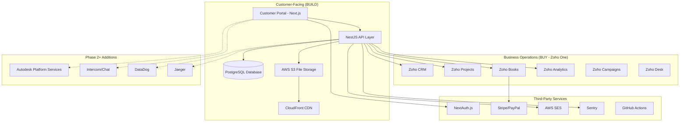
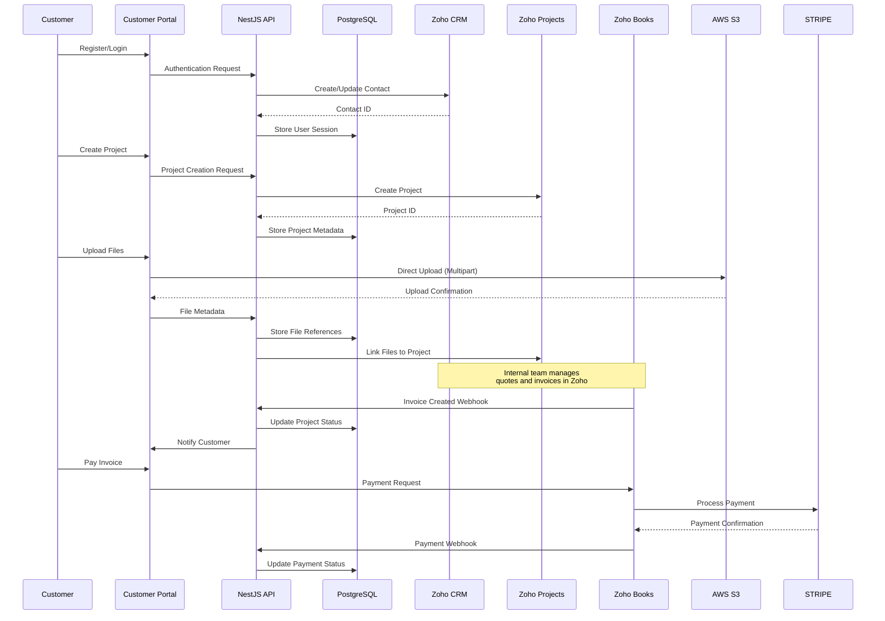

# IdEinstein Backend Design - Final Architecture

## Overview

This document defines the final technical architecture for the IdEinstein backend system, focusing on PostgreSQL caching, RBAC security, real-time updates, and seamless Zoho One integration.

**Status**: Current and Active
**Last Updated**: January 2025
**Implementation Phase**: Ready for Development

## Architecture

### High-Level System Architecture



### Data Flow Architecture



## Components and Interfaces

### 1. Customer Portal (Next.js Frontend)

#### Component Structure
```
src/
├── app/                    # Next.js 13 App Router
│   ├── (auth)/            # Authentication routes
│   │   ├── login/
│   │   └── register/
│   ├── dashboard/         # Main customer dashboard
│   │   ├── projects/      # Project management
│   │   ├── billing/       # Invoice and payment management
│   │   └── profile/       # User profile management
│   └── api/               # API route handlers
├── components/            # Reusable UI components
│   ├── ui/               # Base UI components (shadcn/ui)
│   ├── forms/            # Form components
│   ├── project/          # Project-specific components
│   └── billing/          # Billing-specific components
├── lib/                  # Utility functions
│   ├── auth.ts           # NextAuth configuration
│   ├── api.ts            # API client
│   ├── validations.ts    # Zod schemas
│   └── utils.ts          # Helper functions
└── types/                # TypeScript type definitions
```

#### Key Components

**Authentication Components**
- `LoginForm`: Email/password and Google OAuth login
- `RegisterForm`: User registration with Zoho CRM integration
- `AuthGuard`: Route protection and session management

**Project Management Components**
- `ProjectList`: Display all customer projects with status
- `ProjectDetails`: Detailed project view with files and timeline
- `FileUpload`: Chunked file upload to AWS S3
- `ProjectStatus`: Real-time status updates from Zoho Projects

**Billing Components**
- `InvoiceList`: Display invoices from Zoho Books
- `PaymentForm`: Secure payment processing
- `PaymentHistory`: Transaction history and receipts

### 2. NestJS API Layer

#### Module Structure
```
src/
├── auth/                 # Authentication module
│   ├── auth.controller.ts
│   ├── auth.service.ts
│   ├── jwt.strategy.ts
│   └── guards/
├── users/                # User management
│   ├── users.controller.ts
│   ├── users.service.ts
│   └── dto/
├── projects/             # Project management
│   ├── projects.controller.ts
│   ├── projects.service.ts
│   └── dto/
├── files/                # File management
│   ├── files.controller.ts
│   ├── files.service.ts
│   └── dto/
├── billing/              # Billing integration
│   ├── billing.controller.ts
│   ├── billing.service.ts
│   └── dto/
├── integrations/         # Third-party integrations
│   ├── zoho/
│   │   ├── zoho-crm.service.ts
│   │   ├── zoho-projects.service.ts
│   │   └── zoho-books.service.ts
│   └── aws/
│       └── s3.service.ts
├── common/               # Shared utilities
│   ├── decorators/
│   ├── filters/
│   ├── guards/
│   ├── interceptors/
│   └── pipes/
└── config/               # Configuration
    ├── database.config.ts
    ├── zoho.config.ts
    └── aws.config.ts
```

#### Core Services

**Authentication Service**
```typescript
@Injectable()
export class AuthService {
  async register(registerDto: RegisterDto): Promise<AuthResponse> {
    // 1. Validate user data
    // 2. Create user in PostgreSQL
    // 3. Create contact in Zoho CRM
    // 4. Generate JWT token
    // 5. Return authentication response
  }
  
  async login(loginDto: LoginDto): Promise<AuthResponse> {
    // 1. Validate credentials
    // 2. Generate JWT token
    // 3. Update last login in Zoho CRM
    // 4. Return authentication response
  }
}
```

**Projects Service**
```typescript
@Injectable()
export class ProjectsService {
  async createProject(userId: string, createProjectDto: CreateProjectDto): Promise<Project> {
    // 1. Create project in Zoho Projects
    // 2. Store project metadata in PostgreSQL
    // 3. Link project to user
    // 4. Return project details
  }
  
  async getProjectStatus(projectId: string): Promise<ProjectStatus> {
    // 1. Fetch status from Zoho Projects
    // 2. Cache status in PostgreSQL
    // 3. Return current status
  }
}
```

**Files Service**
```typescript
@Injectable()
export class FilesService {
  async generateUploadUrl(fileMetadata: FileMetadataDto): Promise<UploadUrlResponse> {
    // 1. Generate S3 multipart upload URL
    // 2. Store file metadata in PostgreSQL
    // 3. Return upload URL and upload ID
  }
  
  async completeUpload(uploadId: string): Promise<FileResponse> {
    // 1. Complete S3 multipart upload
    // 2. Update file status in PostgreSQL
    // 3. Link file to project in Zoho Projects
    // 4. Return file details
  }
}
```

### 3. Database Design (PostgreSQL)

#### Core Tables

```sql
-- Users table (minimal, Zoho CRM is source of truth)
CREATE TABLE users (
  id UUID PRIMARY KEY DEFAULT gen_random_uuid(),
  email VARCHAR(255) UNIQUE NOT NULL,
  zoho_contact_id VARCHAR(50) UNIQUE NOT NULL,
  created_at TIMESTAMP DEFAULT CURRENT_TIMESTAMP,
  updated_at TIMESTAMP DEFAULT CURRENT_TIMESTAMP
);

-- Projects table (metadata only, Zoho Projects is source of truth)
CREATE TABLE projects (
  id UUID PRIMARY KEY DEFAULT gen_random_uuid(),
  user_id UUID REFERENCES users(id),
  zoho_project_id VARCHAR(50) UNIQUE NOT NULL,
  name VARCHAR(255) NOT NULL,
  description TEXT,
  status VARCHAR(50) DEFAULT 'draft',
  created_at TIMESTAMP DEFAULT CURRENT_TIMESTAMP,
  updated_at TIMESTAMP DEFAULT CURRENT_TIMESTAMP
);

-- Files table (metadata and S3 references)
CREATE TABLE files (
  id UUID PRIMARY KEY DEFAULT gen_random_uuid(),
  project_id UUID REFERENCES projects(id),
  filename VARCHAR(255) NOT NULL,
  original_filename VARCHAR(255) NOT NULL,
  file_size BIGINT NOT NULL,
  mime_type VARCHAR(100) NOT NULL,
  s3_bucket VARCHAR(100) NOT NULL,
  s3_key VARCHAR(500) NOT NULL,
  upload_status VARCHAR(20) DEFAULT 'pending',
  created_at TIMESTAMP DEFAULT CURRENT_TIMESTAMP
);

-- User sessions (for JWT token management)
CREATE TABLE user_sessions (
  id UUID PRIMARY KEY DEFAULT gen_random_uuid(),
  user_id UUID REFERENCES users(id),
  token_hash VARCHAR(255) NOT NULL,
  expires_at TIMESTAMP NOT NULL,
  created_at TIMESTAMP DEFAULT CURRENT_TIMESTAMP
);

-- Webhook logs (for Zoho webhook tracking)
CREATE TABLE webhook_logs (
  id UUID PRIMARY KEY DEFAULT gen_random_uuid(),
  source VARCHAR(50) NOT NULL,
  event_type VARCHAR(100) NOT NULL,
  payload JSONB NOT NULL,
  processed BOOLEAN DEFAULT FALSE,
  created_at TIMESTAMP DEFAULT CURRENT_TIMESTAMP
);
```

#### Indexes for Performance
```sql
CREATE INDEX idx_users_email ON users(email);
CREATE INDEX idx_users_zoho_contact_id ON users(zoho_contact_id);
CREATE INDEX idx_projects_user_id ON projects(user_id);
CREATE INDEX idx_projects_zoho_project_id ON projects(zoho_project_id);
CREATE INDEX idx_files_project_id ON files(project_id);
CREATE INDEX idx_user_sessions_user_id ON user_sessions(user_id);
CREATE INDEX idx_user_sessions_expires_at ON user_sessions(expires_at);
CREATE INDEX idx_webhook_logs_processed ON webhook_logs(processed);
```

### 4. Zoho Integration Layer

#### Zoho CRM Integration
```typescript
@Injectable()
export class ZohoCrmService {
  async createContact(contactData: CreateContactDto): Promise<ZohoContact> {
    // 1. Authenticate with Zoho CRM API
    // 2. Create contact record
    // 3. Return contact ID and details
  }
  
  async updateContact(contactId: string, updateData: UpdateContactDto): Promise<ZohoContact> {
    // 1. Update contact in Zoho CRM
    // 2. Return updated contact details
  }
  
  async getContact(contactId: string): Promise<ZohoContact> {
    // 1. Fetch contact from Zoho CRM
    // 2. Return contact details
  }
}
```

#### Zoho Projects Integration
```typescript
@Injectable()
export class ZohoProjectsService {
  async createProject(projectData: CreateZohoProjectDto): Promise<ZohoProject> {
    // 1. Create project in Zoho Projects
    // 2. Set up project structure and permissions
    // 3. Return project ID and details
  }
  
  async updateProjectStatus(projectId: string, status: string): Promise<ZohoProject> {
    // 1. Update project status in Zoho Projects
    // 2. Return updated project details
  }
  
  async getProjectDetails(projectId: string): Promise<ZohoProject> {
    // 1. Fetch project details from Zoho Projects
    // 2. Return project information
  }
}
```

#### Zoho Books Integration
```typescript
@Injectable()
export class ZohoBooksService {
  async getInvoices(contactId: string): Promise<ZohoInvoice[]> {
    // 1. Fetch invoices for contact from Zoho Books
    // 2. Return invoice list
  }
  
  async getInvoiceDetails(invoiceId: string): Promise<ZohoInvoice> {
    // 1. Fetch invoice details from Zoho Books
    // 2. Return invoice information
  }
  
  async handlePaymentWebhook(webhookData: ZohoWebhookDto): Promise<void> {
    // 1. Validate webhook signature
    // 2. Process payment status update
    // 3. Update local database
    // 4. Notify customer if needed
  }
}
```

### 5. File Upload System

#### AWS S3 Multipart Upload Flow
```typescript
@Injectable()
export class S3Service {
  async initiateMultipartUpload(fileMetadata: FileMetadataDto): Promise<InitiateUploadResponse> {
    const params = {
      Bucket: this.configService.get('AWS_S3_BUCKET'),
      Key: `projects/${fileMetadata.projectId}/${fileMetadata.filename}`,
      ContentType: fileMetadata.mimeType,
      Metadata: {
        originalFilename: fileMetadata.originalFilename,
        projectId: fileMetadata.projectId,
        userId: fileMetadata.userId
      }
    };
    
    const result = await this.s3Client.createMultipartUpload(params).promise();
    
    return {
      uploadId: result.UploadId,
      key: result.Key,
      bucket: result.Bucket
    };
  }
  
  async generatePresignedUrls(uploadId: string, partCount: number): Promise<PresignedUrl[]> {
    const urls = [];
    
    for (let partNumber = 1; partNumber <= partCount; partNumber++) {
      const url = await this.s3Client.getSignedUrlPromise('uploadPart', {
        Bucket: this.configService.get('AWS_S3_BUCKET'),
        Key: uploadId, // This would be the actual key from initiate response
        PartNumber: partNumber,
        UploadId: uploadId,
        Expires: 3600 // 1 hour
      });
      
      urls.push({ partNumber, url });
    }
    
    return urls;
  }
  
  async completeMultipartUpload(uploadId: string, parts: CompletedPart[]): Promise<CompleteUploadResponse> {
    const params = {
      Bucket: this.configService.get('AWS_S3_BUCKET'),
      Key: uploadId, // This would be the actual key
      UploadId: uploadId,
      MultipartUpload: {
        Parts: parts.map(part => ({
          ETag: part.etag,
          PartNumber: part.partNumber
        }))
      }
    };
    
    const result = await this.s3Client.completeMultipartUpload(params).promise();
    
    return {
      location: result.Location,
      bucket: result.Bucket,
      key: result.Key,
      etag: result.ETag
    };
  }
}
```

## Data Models

### TypeScript Interfaces

```typescript
// User Models
export interface User {
  id: string;
  email: string;
  zohoContactId: string;
  createdAt: Date;
  updatedAt: Date;
}

export interface CreateUserDto {
  email: string;
  password: string;
  firstName: string;
  lastName: string;
  company?: string;
  phone?: string;
}

// Project Models
export interface Project {
  id: string;
  userId: string;
  zohoProjectId: string;
  name: string;
  description: string;
  status: ProjectStatus;
  createdAt: Date;
  updatedAt: Date;
  files?: File[];
}

export enum ProjectStatus {
  DRAFT = 'draft',
  SUBMITTED = 'submitted',
  IN_PROGRESS = 'in_progress',
  REVIEW = 'review',
  COMPLETED = 'completed',
  CANCELLED = 'cancelled'
}

export interface CreateProjectDto {
  name: string;
  description: string;
  projectType: string;
  requirements?: string;
}

// File Models
export interface File {
  id: string;
  projectId: string;
  filename: string;
  originalFilename: string;
  fileSize: number;
  mimeType: string;
  s3Bucket: string;
  s3Key: string;
  uploadStatus: UploadStatus;
  createdAt: Date;
}

export enum UploadStatus {
  PENDING = 'pending',
  UPLOADING = 'uploading',
  COMPLETED = 'completed',
  FAILED = 'failed'
}

// Zoho Integration Models
export interface ZohoContact {
  id: string;
  email: string;
  firstName: string;
  lastName: string;
  company?: string;
  phone?: string;
  createdTime: string;
  modifiedTime: string;
}

export interface ZohoProject {
  id: string;
  name: string;
  description: string;
  status: string;
  ownerId: string;
  createdDate: string;
  modifiedDate: string;
}

export interface ZohoInvoice {
  invoiceId: string;
  invoiceNumber: string;
  contactId: string;
  total: number;
  balance: number;
  status: string;
  dueDate: string;
  createdTime: string;
  paymentUrl?: string;
}
```

### Validation Schemas (Zod)

```typescript
import { z } from 'zod';

// User validation schemas
export const CreateUserSchema = z.object({
  email: z.string().email('Invalid email format'),
  password: z.string().min(8, 'Password must be at least 8 characters'),
  firstName: z.string().min(1, 'First name is required'),
  lastName: z.string().min(1, 'Last name is required'),
  company: z.string().optional(),
  phone: z.string().optional()
});

export const LoginSchema = z.object({
  email: z.string().email('Invalid email format'),
  password: z.string().min(1, 'Password is required')
});

// Project validation schemas
export const CreateProjectSchema = z.object({
  name: z.string().min(1, 'Project name is required').max(255, 'Name too long'),
  description: z.string().min(1, 'Description is required'),
  projectType: z.enum(['cad_modeling', 'analysis', 'design', 'consulting']),
  requirements: z.string().optional()
});

// File validation schemas
export const FileMetadataSchema = z.object({
  filename: z.string().min(1, 'Filename is required'),
  originalFilename: z.string().min(1, 'Original filename is required'),
  fileSize: z.number().positive('File size must be positive').max(5 * 1024 * 1024 * 1024, 'File too large (max 5GB)'),
  mimeType: z.string().min(1, 'MIME type is required'),
  projectId: z.string().uuid('Invalid project ID')
});
```

## Error Handling

### Error Response Format
```typescript
export interface ErrorResponse {
  success: false;
  error: {
    code: string;
    message: string;
    details?: any;
    timestamp: string;
    path: string;
  };
}

export interface SuccessResponse<T = any> {
  success: true;
  data: T;
  message?: string;
  timestamp: string;
}
```

### Global Exception Filter
```typescript
@Catch()
export class GlobalExceptionFilter implements ExceptionFilter {
  private readonly logger = new Logger(GlobalExceptionFilter.name);

  catch(exception: unknown, host: ArgumentsHost) {
    const ctx = host.switchToHttp();
    const response = ctx.getResponse<Response>();
    const request = ctx.getRequest<Request>();

    let status = HttpStatus.INTERNAL_SERVER_ERROR;
    let message = 'Internal server error';
    let code = 'INTERNAL_ERROR';

    if (exception instanceof HttpException) {
      status = exception.getStatus();
      const exceptionResponse = exception.getResponse();
      
      if (typeof exceptionResponse === 'object' && exceptionResponse !== null) {
        message = (exceptionResponse as any).message || message;
        code = (exceptionResponse as any).code || code;
      } else {
        message = exceptionResponse as string;
      }
    } else if (exception instanceof ZodError) {
      status = HttpStatus.BAD_REQUEST;
      message = 'Validation failed';
      code = 'VALIDATION_ERROR';
    }

    const errorResponse: ErrorResponse = {
      success: false,
      error: {
        code,
        message,
        details: exception instanceof ZodError ? exception.errors : undefined,
        timestamp: new Date().toISOString(),
        path: request.url
      }
    };

    this.logger.error(
      `${request.method} ${request.url} - ${status} - ${message}`,
      exception instanceof Error ? exception.stack : exception
    );

    response.status(status).json(errorResponse);
  }
}
```

### Custom Exception Classes
```typescript
export class ZohoIntegrationException extends HttpException {
  constructor(message: string, zohoError?: any) {
    super(
      {
        code: 'ZOHO_INTEGRATION_ERROR',
        message,
        details: zohoError
      },
      HttpStatus.BAD_GATEWAY
    );
  }
}

export class FileUploadException extends HttpException {
  constructor(message: string, details?: any) {
    super(
      {
        code: 'FILE_UPLOAD_ERROR',
        message,
        details
      },
      HttpStatus.BAD_REQUEST
    );
  }
}

export class ProjectNotFoundException extends HttpException {
  constructor(projectId: string) {
    super(
      {
        code: 'PROJECT_NOT_FOUND',
        message: `Project with ID ${projectId} not found`
      },
      HttpStatus.NOT_FOUND
    );
  }
}
```

## Testing Strategy

### Unit Testing Structure
```typescript
// Example: Projects Service Unit Test
describe('ProjectsService', () => {
  let service: ProjectsService;
  let zohoProjectsService: jest.Mocked<ZohoProjectsService>;
  let repository: jest.Mocked<Repository<Project>>;

  beforeEach(async () => {
    const module: TestingModule = await Test.createTestingModule({
      providers: [
        ProjectsService,
        {
          provide: ZohoProjectsService,
          useValue: {
            createProject: jest.fn(),
            getProjectDetails: jest.fn(),
            updateProjectStatus: jest.fn()
          }
        },
        {
          provide: getRepositoryToken(Project),
          useValue: {
            create: jest.fn(),
            save: jest.fn(),
            findOne: jest.fn(),
            find: jest.fn()
          }
        }
      ]
    }).compile();

    service = module.get<ProjectsService>(ProjectsService);
    zohoProjectsService = module.get(ZohoProjectsService);
    repository = module.get(getRepositoryToken(Project));
  });

  describe('createProject', () => {
    it('should create project successfully', async () => {
      const userId = 'user-123';
      const createProjectDto: CreateProjectDto = {
        name: 'Test Project',
        description: 'Test Description',
        projectType: 'cad_modeling'
      };

      const zohoProject = {
        id: 'zoho-project-123',
        name: 'Test Project',
        description: 'Test Description',
        status: 'active',
        ownerId: 'zoho-user-123',
        createdDate: '2024-01-01',
        modifiedDate: '2024-01-01'
      };

      const savedProject = {
        id: 'project-123',
        userId,
        zohoProjectId: 'zoho-project-123',
        name: 'Test Project',
        description: 'Test Description',
        status: ProjectStatus.DRAFT,
        createdAt: new Date(),
        updatedAt: new Date()
      };

      zohoProjectsService.createProject.mockResolvedValue(zohoProject);
      repository.create.mockReturnValue(savedProject as any);
      repository.save.mockResolvedValue(savedProject as any);

      const result = await service.createProject(userId, createProjectDto);

      expect(zohoProjectsService.createProject).toHaveBeenCalledWith(
        expect.objectContaining({
          name: createProjectDto.name,
          description: createProjectDto.description
        })
      );
      expect(repository.create).toHaveBeenCalledWith(
        expect.objectContaining({
          userId,
          zohoProjectId: zohoProject.id,
          name: createProjectDto.name,
          description: createProjectDto.description
        })
      );
      expect(repository.save).toHaveBeenCalledWith(savedProject);
      expect(result).toEqual(savedProject);
    });

    it('should handle Zoho integration errors', async () => {
      const userId = 'user-123';
      const createProjectDto: CreateProjectDto = {
        name: 'Test Project',
        description: 'Test Description',
        projectType: 'cad_modeling'
      };

      zohoProjectsService.createProject.mockRejectedValue(
        new Error('Zoho API Error')
      );

      await expect(
        service.createProject(userId, createProjectDto)
      ).rejects.toThrow(ZohoIntegrationException);
    });
  });
});
```

### Integration Testing
```typescript
// Example: Projects Controller Integration Test
describe('ProjectsController (Integration)', () => {
  let app: INestApplication;
  let authToken: string;

  beforeAll(async () => {
    const moduleFixture: TestingModule = await Test.createTestingModule({
      imports: [AppModule]
    }).compile();

    app = moduleFixture.createNestApplication();
    await app.init();

    // Setup test user and get auth token
    const authResponse = await request(app.getHttpServer())
      .post('/auth/login')
      .send({
        email: 'test@example.com',
        password: 'testpassword'
      });

    authToken = authResponse.body.data.accessToken;
  });

  afterAll(async () => {
    await app.close();
  });

  describe('POST /projects', () => {
    it('should create a new project', async () => {
      const createProjectDto = {
        name: 'Integration Test Project',
        description: 'Test project for integration testing',
        projectType: 'cad_modeling'
      };

      const response = await request(app.getHttpServer())
        .post('/projects')
        .set('Authorization', `Bearer ${authToken}`)
        .send(createProjectDto)
        .expect(201);

      expect(response.body.success).toBe(true);
      expect(response.body.data).toMatchObject({
        name: createProjectDto.name,
        description: createProjectDto.description,
        status: 'draft'
      });
      expect(response.body.data.id).toBeDefined();
      expect(response.body.data.zohoProjectId).toBeDefined();
    });

    it('should return 400 for invalid project data', async () => {
      const invalidProjectDto = {
        name: '', // Invalid: empty name
        description: 'Test description'
      };

      const response = await request(app.getHttpServer())
        .post('/projects')
        .set('Authorization', `Bearer ${authToken}`)
        .send(invalidProjectDto)
        .expect(400);

      expect(response.body.success).toBe(false);
      expect(response.body.error.code).toBe('VALIDATION_ERROR');
    });

    it('should return 401 for unauthenticated requests', async () => {
      const createProjectDto = {
        name: 'Test Project',
        description: 'Test description',
        projectType: 'cad_modeling'
      };

      await request(app.getHttpServer())
        .post('/projects')
        .send(createProjectDto)
        .expect(401);
    });
  });
});
```

This comprehensive design document provides a detailed technical blueprint for implementing the IdEinstein platform with a focus on the strategic "build vs buy" approach, leveraging Zoho One suite for business operations while building a world-class customer portal.